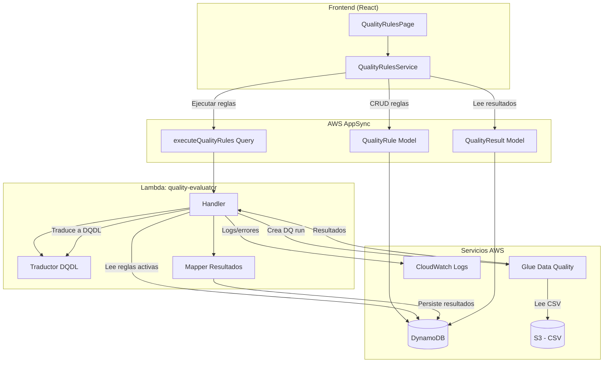
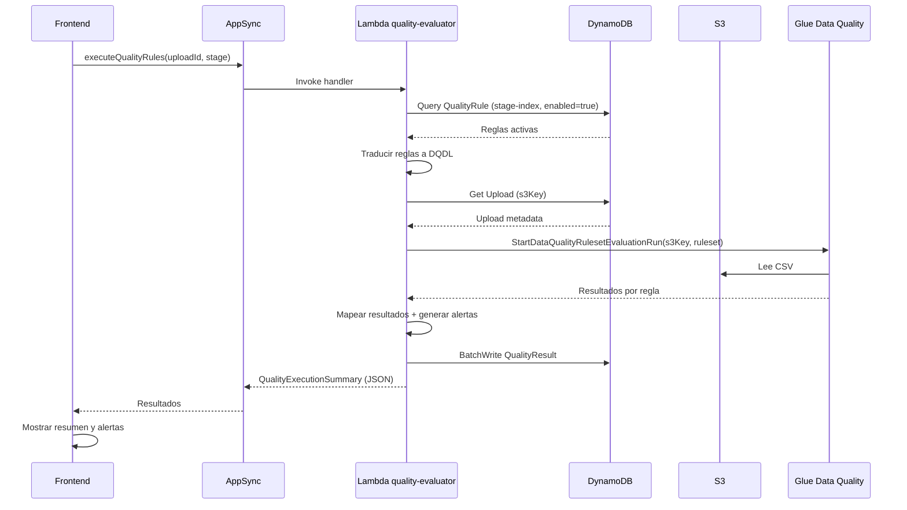

# Diseño Técnico — Integración con AWS Glue Data Quality

## Resumen

Este diseño describe la migración del motor de evaluación de reglas de calidad desde el frontend (evaluación en memoria en `QualityRulesService`) hacia AWS Glue Data Quality ejecutado vía Lambda. Los cambios principales son:

1. Persistir reglas de calidad en DynamoDB (tabla `QualityRule`) en lugar de un `Map` en memoria.
2. Implementar un traductor que convierte la configuración de reglas al formato DQDL (Data Quality Definition Language).
3. Crear una Lambda (`quality-evaluator`) que orquesta la ejecución de reglas vía Glue Data Quality API contra archivos CSV en S3.
4. Exponer la ejecución como custom query de AppSync para invocación desde el frontend.
5. Adaptar el frontend para invocar la ejecución backend, mostrar resultados y validar expresiones DQDL.

## Arquitectura



### Flujo de ejecución

1. El Operador presiona "Ejecutar Reglas" en la UI.
2. El frontend invoca la query `executeQualityRules` de AppSync con `uploadId` y `stage`.
3. AppSync invoca la Lambda `quality-evaluator`.
4. La Lambda lee las reglas activas de la tabla `QualityRule` filtradas por `stage`.
5. El `Traductor DQDL` convierte las reglas al formato `Rules = [ ... ]`.
6. La Lambda crea un Glue Data Quality run apuntando al CSV en S3.
7. Glue Data Quality evalúa las reglas y retorna resultados.
8. La Lambda mapea los resultados al formato `QualityResultRecord` y los persiste en `QualityResult`.
9. La Lambda retorna un `QualityExecutionSummary` al frontend.
10. El frontend muestra el resumen y actualiza la pestaña de resultados.

### Decisiones de diseño

- **Lambda en lugar de Step Functions**: La ejecución es una operación síncrona simple (invocar Glue DQ, esperar resultado, persistir). No requiere orquestación compleja.
- **Custom query de AppSync**: Sigue el patrón existente (`analyzeFindings`, `manageUsers`). Permite reutilizar la autenticación Cognito y los permisos por grupo.
- **Traductor DQDL como módulo puro**: Sin dependencias de AWS, testeable unitariamente. Se comparte entre Lambda y frontend (validación).
- **Tabla QualityRule separada**: Las reglas son entidades de primera clase con su propio ciclo de vida CRUD, no subdocumentos de otra tabla.


## Componentes e Interfaces

### 1. Tabla DynamoDB: `QualityRule`

Nuevo modelo en `amplify/data/resource.ts` para persistir reglas de calidad.

```typescript
QualityRule: a
  .model({
    ruleId: a.id().required(),
    ruleName: a.string().required(),
    stage: a.string().required(),        // CascadeStage
    type: a.string().required(),         // QualityRuleType
    expression: a.string().required(),   // Expresión DQDL o config
    targetColumn: a.string(),
    threshold: a.float().required(),     // 0.0 - 1.0
    enabled: a.boolean().required(),
    createdAt: a.datetime().required(),
    updatedBy: a.string(),
  })
  .identifier(['ruleId'])
  .secondaryIndexes((index) => [
    index('stage').sortKeys(['createdAt']).name('stage-index'),
  ])
  .authorization((allow) => [
    allow.group('Administrator'),
    allow.group('Operator').to(['read']),
  ])
```

### 2. Traductor DQDL (`src/services/dqdl-translator.ts`)

Módulo puro (sin dependencias AWS) que convierte reglas de la plataforma a sintaxis DQDL.

```typescript
interface DqdlTranslationResult {
  ruleset: string;          // Texto DQDL completo: Rules = [ ... ]
  errors: DqdlError[];      // Errores de traducción por regla
}

interface DqdlError {
  ruleId: string;
  ruleName: string;
  message: string;
}

// API pública
function translateRulesToDqdl(rules: QualityRule[]): DqdlTranslationResult;
function translateSingleRule(rule: QualityRule): string;  // Una regla → expresión DQDL
function validateDqdlExpression(expression: string): { valid: boolean; error?: string };
function parseDqdlRuleset(dqdlText: string): QualityRule[];  // Para round-trip testing
```

Mapeo de tipos a DQDL:

| Tipo plataforma | Expresión DQDL generada |
|---|---|
| `completeness` | `Completeness "columna" >= umbral` |
| `uniqueness` | `Uniqueness "columna" >= umbral` |
| `range` | `ColumnValues "columna" between min and max` |
| `format` | `ColumnValues "columna" matches "regex"` |
| `custom` | Expresión pasada directamente sin transformación |

### 3. Lambda `quality-evaluator` (`amplify/functions/quality-evaluator/handler.ts`)

Handler de AppSync que orquesta la ejecución de reglas.

```typescript
// Input (arguments de la query AppSync)
interface ExecuteQualityRulesInput {
  uploadId: string;
  stage: string;  // CascadeStage
}

// Output (retorno JSON stringificado)
interface QualityExecutionSummary {
  uploadId: string;
  stage: string;
  totalRules: number;
  passed: number;
  failed: number;
  results: QualityResultRecord[];
  alerts: QualityAlert[];
  executedAt: string;
}
```

Dependencias AWS SDK:
- `@aws-sdk/client-glue` — para `StartDataQualityRulesetEvaluationRun`, `GetDataQualityRulesetEvaluationRun`, `GetDataQualityResult`
- `@aws-sdk/client-dynamodb` + `@aws-sdk/lib-dynamodb` — para leer reglas y escribir resultados

### 4. Custom Query AppSync (`executeQualityRules`)

Nuevo query en `amplify/data/resource.ts`:

```typescript
executeQualityRules: a
  .query()
  .arguments({
    uploadId: a.string().required(),
    stage: a.string().required(),
  })
  .returns(a.string())
  .handler(a.handler.function(qualityEvaluatorFn))
  .authorization((allow) => [
    allow.group('Administrator'),
    allow.group('Operator'),
  ])
```

### 5. QualityRulesService refactorizado (`src/services/quality-rules.ts`)

Cambios principales:
- CRUD opera contra DynamoDB (vía `client.models.QualityRule`) en lugar del `Map` en memoria.
- `executeRules()` invoca la query AppSync `executeQualityRules` en lugar de evaluar localmente.
- Nuevo método `validateExpression()` que usa el traductor DQDL para validación en el frontend.
- Se elimina el motor de evaluación local (`evaluateRule`, `evaluateCompleteness`, etc.).

```typescript
class QualityRulesService {
  // CRUD — ahora async, opera contra DynamoDB
  async createRule(input: CreateQualityRuleInput): Promise<QualityRule>;
  async updateRule(ruleId: string, input: UpdateQualityRuleInput): Promise<QualityRule | null>;
  async deleteRule(ruleId: string): Promise<boolean>;
  async listRules(stage?: CascadeStage): Promise<QualityRule[]>;
  async getRule(ruleId: string): Promise<QualityRule | null>;

  // Ejecución — delega al backend
  async executeRules(uploadId: string, stage: CascadeStage): Promise<QualityExecutionSummary>;

  // Validación DQDL — usa traductor local
  validateExpression(expression: string, type: QualityRuleType): { valid: boolean; error?: string };

  // Consulta de resultados históricos
  async getExecutionResults(filters?: ResultFilters): Promise<QualityExecutionSummary[]>;
}
```

### 6. Componente QualityRulesPage actualizado

Cambios en la UI:
- Formulario de reglas incluye validación DQDL en tiempo real y auto-generación de expresiones base por tipo.
- Botón "Ejecutar Reglas" invoca `executeRules()` con indicador de carga.
- Pestaña "Resultados de Ejecución" carga datos desde DynamoDB con filtros por etapa y rango de fechas.
- Alertas de severidad mostradas con chips de color (critical=rojo, high=naranja, medium=amarillo, low=azul).

### 7. Validador DQDL en frontend

El módulo `dqdl-translator.ts` se comparte entre Lambda y frontend. En el frontend se usa para:
- Validar expresiones al crear/editar reglas (criterio 6.1, 6.2).
- Generar expresiones base al seleccionar tipo de regla (criterio 6.4).
- Mostrar ejemplos de DQDL válido como ayuda contextual (criterio 6.3).


## Modelos de Datos

### Tabla QualityRule (nueva)

| Campo | Tipo | Requerido | Descripción |
|---|---|---|---|
| `ruleId` | `ID` | Sí | PK. UUID generado al crear. |
| `ruleName` | `String` | Sí | Nombre descriptivo de la regla. |
| `stage` | `String` | Sí | CascadeStage donde aplica. |
| `type` | `String` | Sí | Tipo: completeness, uniqueness, range, format, referential, custom. |
| `expression` | `String` | Sí | Expresión de la regla (config o DQDL directo para custom). |
| `targetColumn` | `String` | No | Columna objetivo (aplica a completeness, uniqueness, range, format). |
| `threshold` | `Float` | Sí | Umbral de aprobación 0.0–1.0. Default 1.0. |
| `enabled` | `Boolean` | Sí | Si la regla está activa. |
| `createdAt` | `DateTime` | Sí | Timestamp de creación. |
| `updatedBy` | `String` | No | ID del último usuario que modificó. |

GSI: `stage-index` (PK=stage, SK=createdAt) para listar reglas por etapa.

Autorización:
- Administrator: CRUD completo.
- Operator: solo lectura.

### Tabla QualityResult (existente, sin cambios de esquema)

| Campo | Tipo | Descripción |
|---|---|---|
| `uploadId` | `String` | PK. ID del upload evaluado. |
| `ruleId` | `String` | SK. ID de la regla evaluada. |
| `ruleName` | `String` | Nombre de la regla. |
| `ruleExpression` | `String` | Expresión DQDL ejecutada. |
| `result` | `Enum` | `passed` o `failed`. |
| `details` | `JSON` | Detalles: recordsEvaluated, recordsPassed, recordsFailed, compliancePercent, message. |
| `executedAt` | `DateTime` | Timestamp de ejecución. |

### Interfaces TypeScript actualizadas

```typescript
// src/types/quality.ts — cambios

// Nuevo: filtros para consulta de resultados
interface ResultFilters {
  stage?: CascadeStage;
  dateFrom?: string;  // ISO date
  dateTo?: string;    // ISO date
}

// Actualizado: QualityExecutionSummary incluye alertas
interface QualityExecutionSummary {
  uploadId: string;
  stage: CascadeStage;
  totalRules: number;
  passed: number;
  failed: number;
  results: QualityResultRecord[];
  alerts: QualityAlert[];      // Nuevo campo
  executedAt: string;
}

// Nuevo: resultado de traducción DQDL
interface DqdlTranslationResult {
  ruleset: string;
  errors: DqdlError[];
}

interface DqdlError {
  ruleId: string;
  ruleName: string;
  message: string;
}
```

### Flujo de datos: Ejecución de reglas




## Propiedades de Correctitud

*Una propiedad es una característica o comportamiento que debe cumplirse en todas las ejecuciones válidas de un sistema — esencialmente, una declaración formal sobre lo que el sistema debe hacer. Las propiedades sirven como puente entre especificaciones legibles por humanos y garantías de correctitud verificables por máquina.*

### Propiedad 1: Round-trip de creación de regla

*Para cualquier* entrada válida de creación de regla (con ruleName, stage, type, expression, targetColumn, threshold y enabled válidos), crear la regla y luego leerla por su ruleId debe retornar una regla con todos los campos coincidentes con la entrada original, incluyendo ruleId, ruleName, stage, type, expression, targetColumn, threshold, enabled y createdAt.

**Valida: Requisitos 1.1, 1.2**

### Propiedad 2: Round-trip de actualización de regla

*Para cualquier* regla existente y cualquier entrada válida de actualización, actualizar la regla y luego leerla debe retornar una regla donde los campos actualizados reflejen los nuevos valores y los campos no actualizados permanezcan sin cambios.

**Valida: Requisito 1.3**

### Propiedad 3: Eliminación remueve la regla

*Para cualquier* regla existente, eliminarla y luego intentar leerla por su ruleId debe retornar null, y la regla no debe aparecer en el listado de reglas.

**Valida: Requisito 1.4**

### Propiedad 4: Traducción de tipo de regla a formato DQDL

*Para cualquier* regla con tipo "completeness", "uniqueness", "range", "format" o "custom", y con columna y umbral válidos, la traducción a DQDL debe producir una expresión que coincida con el formato esperado para ese tipo (e.g., `Completeness "col" >= 0.95` para completeness, `Uniqueness "col" >= 0.95` para uniqueness, etc.). Para reglas "custom", la expresión de salida debe ser idéntica a la expresión de entrada.

**Valida: Requisitos 2.1, 2.2, 2.3, 2.4, 2.5**

### Propiedad 5: Estructura de Ruleset DQDL

*Para cualquier* conjunto no vacío de reglas activas, el Ruleset DQDL generado debe comenzar con `Rules = [`, terminar con `]`, y contener exactamente una expresión DQDL por cada regla del conjunto, separadas por comas.

**Valida: Requisito 2.6**

### Propiedad 6: Error en expresión DQDL inválida

*Para cualquier* regla cuya expresión DQDL sea sintácticamente inválida, el traductor debe retornar un error que contenga el ruleId de la regla y un mensaje de error no vacío describiendo el problema.

**Valida: Requisito 2.7**

### Propiedad 7: Round-trip de traducción DQDL

*Para cualquier* conjunto válido de reglas de calidad, traducir las reglas a texto DQDL y luego parsear ese texto de vuelta debe producir un conjunto de reglas equivalente al original (mismos tipos, columnas, umbrales y expresiones).

**Valida: Requisito 2.8**

### Propiedad 8: Filtrado de reglas por etapa

*Para cualquier* conjunto de reglas distribuidas en múltiples CascadeStages y cualquier etapa de filtro, listar reglas filtradas por esa etapa debe retornar únicamente reglas cuyo campo `stage` coincida con la etapa solicitada, y todas las reglas de esa etapa deben estar presentes en el resultado.

**Valida: Requisito 3.2**

### Propiedad 9: Mapeo de resultados Glue a QualityResultRecord

*Para cualquier* resultado de Glue Data Quality (con ruleId, outcome, evaluatedCount, passedCount, failedCount), el mapper debe producir un QualityResultRecord con: result igual a "passed" o "failed" según el outcome, recordsEvaluated igual a evaluatedCount, recordsPassed igual a passedCount, recordsFailed igual a failedCount, y compliancePercent calculado como (passedCount / evaluatedCount) * 100.

**Valida: Requisito 3.5**

### Propiedad 10: Invariante de conteos en resumen de ejecución

*Para cualquier* conjunto de resultados de reglas, el QualityExecutionSummary debe cumplir: `passed + failed == totalRules`, `totalRules == results.length`, y los conteos de passed/failed deben coincidir con el número de resultados individuales con result "passed" y "failed" respectivamente.

**Valida: Requisito 3.7**

### Propiedad 11: Determinación de severidad de alertas

*Para cualquier* porcentaje de cumplimiento entre 0 y 100, la severidad asignada debe ser: "critical" si < 25%, "high" si >= 25% y < 50%, "medium" si >= 50% y < 75%, "low" si >= 75%. Además, para cualquier regla fallida, debe generarse exactamente una alerta.

**Valida: Requisitos 5.1, 5.2, 5.3, 5.4, 5.5**

### Propiedad 12: Validación DQDL rechaza expresiones inválidas

*Para cualquier* cadena que no sea una expresión DQDL válida (e.g., cadenas vacías, sintaxis incorrecta, funciones inexistentes), el validador debe retornar `valid: false` con un mensaje de error no vacío.

**Valida: Requisito 6.1**

### Propiedad 13: Generación de expresión DQDL base por tipo

*Para cualquier* tipo de regla en ["completeness", "uniqueness", "range", "format"] y cualquier nombre de columna no vacío, la función de generación de expresión base debe producir una cadena DQDL no vacía que sea sintácticamente válida según el validador DQDL.

**Valida: Requisito 6.4**

### Propiedad 14: Resultados ordenados por fecha descendente

*Para cualquier* conjunto de resultados de ejecución almacenados, la consulta sin filtros debe retornarlos ordenados por `executedAt` de forma descendente (el más reciente primero).

**Valida: Requisito 7.1**

### Propiedad 15: Filtrado de resultados por etapa y rango de fechas

*Para cualquier* conjunto de resultados y cualquier combinación de filtros (stage y/o dateFrom/dateTo), todos los resultados retornados deben cumplir todos los filtros aplicados, y ningún resultado que cumpla los filtros debe ser excluido.

**Valida: Requisitos 7.2, 7.4**

### Propiedad 16: Detalles de resultado contienen campos requeridos

*Para cualquier* QualityResultRecord, los detalles deben incluir: ruleName (no vacío), result ("passed" o "failed"), recordsEvaluated (>= 0), compliancePercent (0-100), y message (no vacío).

**Valida: Requisito 7.3**


## Manejo de Errores

### Lambda `quality-evaluator`

| Escenario | Comportamiento | Código/Respuesta |
|---|---|---|
| Upload no encontrado en DynamoDB | Retorna error con mensaje descriptivo | `{ error: "Upload {uploadId} no encontrado" }` |
| No hay reglas activas para la etapa | Retorna resumen vacío (totalRules=0, passed=0, failed=0) | Respuesta exitosa con resultados vacíos |
| Error de traducción DQDL | Retorna error con detalle de la regla problemática | `{ error: "Error DQDL en regla {ruleId}: {mensaje}" }` |
| Glue Data Quality falla (timeout, permisos, etc.) | Log en CloudWatch + retorna error descriptivo | `{ error: "Error Glue DQ: {mensaje}" }` |
| Error al persistir resultados en DynamoDB | Log en CloudWatch, no interrumpe la respuesta. Los resultados se retornan aunque no se persistan. | Respuesta exitosa con warning |
| Archivo CSV no encontrado en S3 | Retorna error indicando que el archivo no existe | `{ error: "Archivo S3 no encontrado: {s3Key}" }` |

### Traductor DQDL

| Escenario | Comportamiento |
|---|---|
| Regla sin `targetColumn` (requerida para completeness/uniqueness/range/format) | Retorna `DqdlError` con mensaje indicando que la columna es requerida |
| Expresión de rango con formato inválido (no "min,max") | Retorna `DqdlError` con mensaje indicando el formato esperado |
| Expresión regex inválida en regla format | Retorna `DqdlError` con mensaje del error de regex |
| Regla custom con expresión vacía | Retorna `DqdlError` indicando que la expresión no puede estar vacía |

### Frontend

| Escenario | Comportamiento UI |
|---|---|
| Error de red al invocar AppSync | Snackbar con "Error de conexión. Intente nuevamente." |
| Error retornado por Lambda | Alert con el mensaje de error de la Lambda |
| Timeout de ejecución (>30s) | Snackbar con "La ejecución está tardando más de lo esperado." |
| Error al cargar reglas desde DynamoDB | Alert con "Error al cargar reglas. Intente recargar la página." |
| Validación DQDL falla al guardar regla | Mensaje de error inline debajo del campo de expresión |

## Estrategia de Testing

### Enfoque dual: Tests unitarios + Tests basados en propiedades

La estrategia combina tests unitarios para ejemplos específicos y casos borde con tests basados en propiedades para verificar comportamiento universal.

### Librería de property-based testing

- **Librería**: `fast-check` (compatible con Vitest, el test runner del proyecto)
- **Configuración**: Mínimo 100 iteraciones por propiedad (`{ numRuns: 100 }`)
- **Etiquetado**: Cada test de propiedad debe incluir un comentario con formato:
  `// Feature: glue-data-quality-integration, Property {N}: {título}`

### Tests unitarios

Enfocados en:
- Ejemplos concretos de traducción DQDL (una regla completeness específica → DQDL esperado)
- Casos borde: regla sin columna, expresión vacía, umbral 0, umbral 1
- Integración: mock de AppSync para verificar que el frontend invoca correctamente `executeQualityRules`
- UI: renderizado de alertas con severidad correcta, botón deshabilitado sin reglas activas
- Error handling: respuestas de error de Lambda mapeadas a mensajes de UI

### Tests basados en propiedades

Cada propiedad de correctitud (1-16) se implementa como un test `fast-check` individual:

| Propiedad | Módulo bajo test | Generadores principales |
|---|---|---|
| 1: Round-trip creación | `QualityRulesService` | `fc.record({ ruleName, stage, type, expression, ... })` |
| 2: Round-trip actualización | `QualityRulesService` | Regla existente + `fc.record({ campos parciales })` |
| 3: Eliminación remueve | `QualityRulesService` | Regla existente |
| 4: Traducción por tipo | `dqdl-translator` | `fc.record({ type, targetColumn, threshold, expression })` |
| 5: Estructura ruleset | `dqdl-translator` | `fc.array(fc.record({ regla válida }), { minLength: 1 })` |
| 6: Error expresión inválida | `dqdl-translator` | `fc.record({ regla con expresión inválida })` |
| 7: Round-trip DQDL | `dqdl-translator` | `fc.array(fc.record({ regla válida }))` |
| 8: Filtrado por etapa | `QualityRulesService` | `fc.array(reglas) + fc.constantFrom(...stages)` |
| 9: Mapeo resultados Glue | `result-mapper` | `fc.record({ glueResult })` |
| 10: Invariante conteos | `summary-builder` | `fc.array(fc.record({ result: fc.constantFrom('passed','failed') }))` |
| 11: Severidad alertas | `alert-generator` | `fc.float({ min: 0, max: 100 })` |
| 12: Validación rechaza inválidos | `dqdl-translator` | `fc.string()` filtrado a expresiones inválidas |
| 13: Expresión base por tipo | `dqdl-translator` | `fc.constantFrom('completeness',...) + fc.string({ minLength: 1 })` |
| 14: Orden por fecha | `QualityRulesService` | `fc.array(fc.record({ executedAt: fc.date() }))` |
| 15: Filtrado resultados | `QualityRulesService` | `fc.array(resultados) + fc.record({ filtros })` |
| 16: Campos requeridos | `result-mapper` | `fc.record({ resultado Glue })` |

### Estructura de archivos de test

```
src/services/__tests__/
  dqdl-translator.test.ts          # Unit tests + Properties 4-7, 12, 13
  dqdl-translator.property.test.ts # Property tests dedicados
  quality-rules.test.ts            # Unit tests + Properties 1-3, 8
  quality-rules.property.test.ts   # Property tests dedicados
  result-mapper.test.ts            # Unit tests + Properties 9, 10, 16
  alert-generator.test.ts          # Unit tests + Property 11
  result-filters.test.ts           # Unit tests + Properties 14, 15
```

