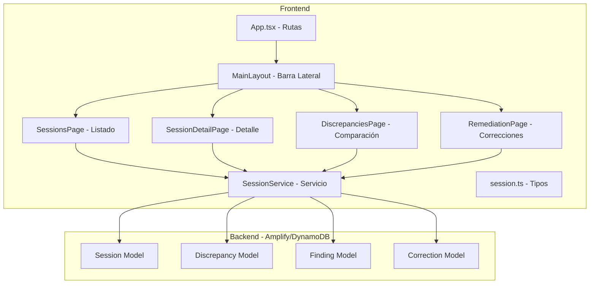
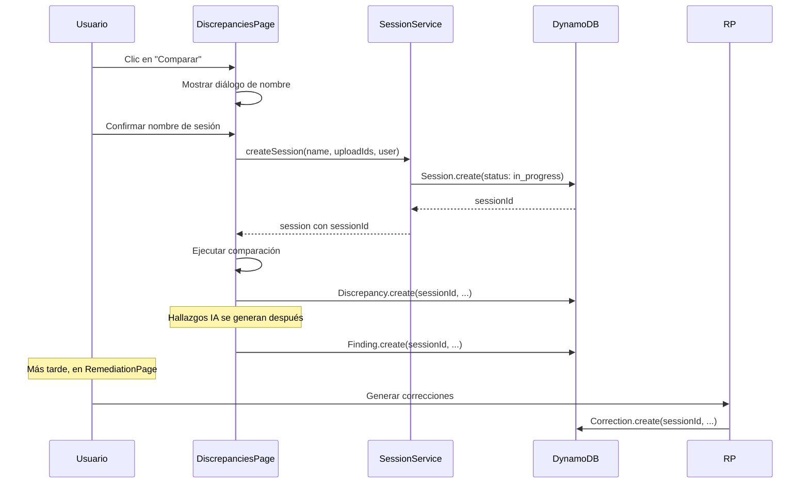
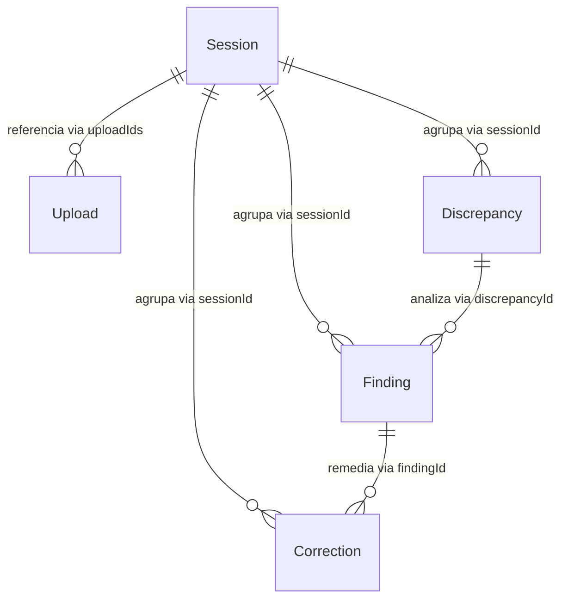

# Documento de Diseño — Sesiones de Trabajo

## Resumen

Este documento describe el diseño técnico para implementar el concepto de **Sesiones de Trabajo** en la plataforma de reconciliación de datos. Una sesión agrupa el ciclo completo de una reconciliación: los 4 archivos CSV subidos, las discrepancias detectadas, los hallazgos IA generados y las correcciones propuestas. Adicionalmente, se incluyen mejoras de UI/UX en tipografía, bordes redondeados, transiciones y la corrección del botón de colapsar la barra lateral.

### Hallazgos de Investigación

- El esquema actual en `amplify/data/resource.ts` ya usa `sessionId` como parte de la clave compuesta de `Discrepancy`, pero no existe un modelo `Session` dedicado. Actualmente se genera un UUID efímero en `DiscrepanciesPage.tsx` que no se persiste como entidad propia.
- El modelo `Finding` usa `discrepancyId` como partition key, sin referencia directa a sesión. Para asociar hallazgos a una sesión, se puede agregar un campo `sessionId` opcional al modelo.
- El modelo `Correction` tampoco tiene `sessionId`. Se necesita agregar el campo para vincular correcciones a sesiones.
- El `MainLayout.tsx` tiene un problema de z-index: el `AppBar` usa `zIndex: drawer + 1`, lo que oculta el botón de colapsar del Drawer. El Toolbar del Drawer no tiene padding-top para compensar la altura del AppBar.
- El tema actual usa `Roboto` como fuente y `borderRadius: 12` como base. Los requisitos piden `Inter` como fuente principal y transiciones de 200ms.
- La librería `fast-check` ya está instalada como devDependency para property-based testing.

## Arquitectura

### Diagrama de Componentes



### Flujo de Datos de una Sesión



## Componentes e Interfaces

### 1. Modelo de Datos — `Session` (amplify/data/resource.ts)

Nuevo modelo en el esquema Amplify que representa una sesión de trabajo.

```typescript
Session: a
  .model({
    sessionId: a.id().required(),
    sessionName: a.string().required(),
    status: a.enum(['in_progress', 'completed', 'archived']),
    createdBy: a.string().required(),
    createdAt: a.datetime().required(),
    completedAt: a.datetime(),
    uploadIds: a.string().array().required(),
    discrepancyCount: a.integer(),
    findingCount: a.integer(),
  })
  .identifier(['sessionId'])
  .secondaryIndexes((index) => [
    index('status').sortKeys(['createdAt']).name('status-date-index'),
  ])
  .authorization((allow) => [
    allow.group('Administrator'),
    allow.group('Operator'),
  ]),
```

### 2. Campos adicionales en modelos existentes

**Finding** — agregar campo `sessionId`:
```typescript
sessionId: a.string(),  // opcional para retrocompatibilidad
```

**Correction** — agregar campo `sessionId`:
```typescript
sessionId: a.string(),  // opcional para retrocompatibilidad
```

### 3. Tipos TypeScript — `src/types/session.ts`

```typescript
export type SessionStatus = 'in_progress' | 'completed' | 'archived';

export interface Session {
  sessionId: string;
  sessionName: string;
  status: SessionStatus;
  createdBy: string;
  createdAt: string;
  completedAt?: string;
  uploadIds: string[];
  discrepancyCount?: number;
  findingCount?: number;
}

export interface CreateSessionInput {
  sessionName: string;
  uploadIds: string[];
  createdBy: string;
}

export interface SessionFilters {
  status?: SessionStatus;
  searchQuery?: string;
}

export interface PaginatedSessions {
  items: Session[];
  nextToken?: string | null;
}
```

### 4. Servicio de Sesiones — `src/services/session.ts`

Servicio singleton que encapsula las operaciones CRUD de sesiones usando el cliente Amplify Data.

**Métodos públicos:**
- `createSession(input: CreateSessionInput): Promise<Session>` — Crea una sesión con estado `in_progress`.
- `getSession(sessionId: string): Promise<Session | null>` — Obtiene una sesión por ID.
- `listSessions(filters?: SessionFilters): Promise<PaginatedSessions>` — Lista sesiones con filtros opcionales por estado y búsqueda por nombre.
- `updateSessionStatus(sessionId: string, status: SessionStatus): Promise<Session>` — Cambia el estado de una sesión. Si el nuevo estado es `completed`, registra `completedAt`.
- `updateSessionCounts(sessionId: string, discrepancyCount: number, findingCount: number): Promise<void>` — Actualiza los contadores de discrepancias y hallazgos.
- `getSessionDiscrepancies(sessionId: string): Promise<Discrepancy[]>` — Obtiene discrepancias de una sesión usando la partition key de Discrepancy.
- `getSessionFindings(sessionId: string): Promise<Finding[]>` — Obtiene hallazgos asociados a una sesión.
- `getSessionCorrections(sessionId: string): Promise<Correction[]>` — Obtiene correcciones asociadas a una sesión.

### 5. Página de Listado de Sesiones — `src/components/pages/SessionsPage.tsx`

Página que muestra una tabla con todas las sesiones pasadas.

**Funcionalidad:**
- Tabla con columnas: nombre, fecha de creación, estado (Chip con color), usuario, # discrepancias, # hallazgos.
- Ordenamiento por fecha descendente (más recientes primero).
- Filtro por estado mediante Select (in_progress, completed, archived).
- Búsqueda por nombre mediante TextField.
- Clic en fila navega a `/sessions/:sessionId`.

**Estado del componente:**
- `sessions: Session[]` — lista de sesiones cargadas.
- `loading: boolean` — indicador de carga.
- `statusFilter: SessionStatus | ''` — filtro de estado activo.
- `searchQuery: string` — texto de búsqueda.

### 6. Página de Detalle de Sesión — `src/components/pages/SessionDetailPage.tsx`

Vista de detalle con pestañas para cada tipo de artefacto.

**Pestañas:**
1. **Información General** — nombre, fecha, estado, usuario, botones de cambio de estado.
2. **Archivos** — tabla con los 4 uploads asociados (nombre, etapa, fecha).
3. **Discrepancias** — tabla con las mismas columnas que DiscrepanciesPage.
4. **Hallazgos IA** — tabla con severidad, explicación, causa, recomendación.
5. **Correcciones** — tabla con estado, acción, fechas.

**Gestión de estado:**
- Botón "Completar Sesión" visible cuando `status === 'in_progress'`.
- Botón "Archivar Sesión" visible cuando `status === 'completed'`.
- Modo solo lectura cuando `status === 'archived'`.

### 7. Integración con DiscrepanciesPage

**Cambios en `DiscrepanciesPage.tsx`:**
- Antes de ejecutar la comparación, mostrar un `Dialog` pidiendo el nombre de la sesión.
- Al confirmar, llamar a `SessionService.createSession()` para obtener un `sessionId`.
- Usar ese `sessionId` al guardar discrepancias (ya se pasa a `comparisonService.saveDiscrepancies`).
- Almacenar el `sessionId` activo en estado del componente para pasarlo a hallazgos.
- Si el usuario cancela el diálogo, no ejecutar la comparación.

### 8. Integración con Hallazgos y Correcciones

**Finding:** Al generar hallazgos en `DiscrepanciesPage` o `FindingsPage`, pasar el `sessionId` activo al crear cada `Finding` en DynamoDB.

**Correction:** En `RemediationPage`, al proponer correcciones, incluir el `sessionId` de la sesión activa. Se necesita un mecanismo para determinar la sesión activa (la más reciente con estado `in_progress`).

### 9. Rutas — `src/App.tsx`

Nuevas rutas dentro del layout protegido:
```
/sessions          → SessionsPage
/sessions/:id      → SessionDetailPage
```

### 10. Barra Lateral — `src/components/templates/MainLayout.tsx`

Agregar elemento de navegación "Sesiones" con ícono `WorkHistoryIcon` entre "Discrepancias" y "Agente Conversacional".

**Corrección del botón de colapsar:**
- Agregar `paddingTop` al contenedor del Drawer equivalente a la altura del AppBar (64px) para que el Toolbar con el botón de colapsar quede debajo del AppBar.
- Alternativa: usar `mt: '64px'` en el Box del drawer content.

### 11. Tema Visual — `src/theme.ts`

**Tipografía:**
- Fuente principal: `"Inter", "Roboto", "Helvetica", "Arial", sans-serif`.
- Peso 600 para h1-h6, peso 400 para body.
- Interlineado 1.6 para body1 y body2.

**Bordes:**
- Base: 12px (ya existente).
- Card: 16px (ya existente).
- Button: 20px (ya existente).
- Paper: 16px (nuevo).
- TableContainer: 12px (nuevo).
- Chip: 8px (nuevo).

**Transiciones:**
- 200ms en Button, Card, Paper, TableRow para hover/focus.

## Modelos de Datos

### Modelo Session (DynamoDB)

| Campo | Tipo | Requerido | Descripción |
|-------|------|-----------|-------------|
| sessionId | ID (PK) | Sí | Identificador único UUID |
| sessionName | String | Sí | Nombre descriptivo de la sesión |
| status | Enum | Sí | `in_progress`, `completed`, `archived` |
| createdBy | String | Sí | Email del usuario creador |
| createdAt | DateTime | Sí | Fecha ISO-8601 de creación |
| completedAt | DateTime | No | Fecha ISO-8601 de finalización |
| uploadIds | String[] | Sí | Array con los 4 uploadIds asociados |
| discrepancyCount | Integer | No | Cantidad de discrepancias detectadas |
| findingCount | Integer | No | Cantidad de hallazgos generados |

**Índice secundario:** `status-date-index` (PK: status, SK: createdAt) para consultas ordenadas por fecha dentro de un estado.

### Campos Adicionales en Modelos Existentes

**Finding:**
| Campo | Tipo | Requerido | Descripción |
|-------|------|-----------|-------------|
| sessionId | String | No | ID de la sesión asociada (retrocompatible) |

**Correction:**
| Campo | Tipo | Requerido | Descripción |
|-------|------|-----------|-------------|
| sessionId | String | No | ID de la sesión asociada (retrocompatible) |

### Relaciones entre Modelos




## Propiedades de Correctitud

*Una propiedad es una característica o comportamiento que debe mantenerse verdadero en todas las ejecuciones válidas de un sistema — esencialmente, una declaración formal sobre lo que el sistema debe hacer. Las propiedades sirven como puente entre especificaciones legibles por humanos y garantías de correctitud verificables por máquina.*

### Propiedad 1: Correctitud de creación de sesión

*Para cualquier* nombre de sesión válido (no vacío), lista de 4 uploadIds y usuario creador, al crear una sesión, el objeto resultante debe contener exactamente el nombre proporcionado, los uploadIds proporcionados, el usuario creador, un sessionId no vacío, un createdAt válido y el estado `in_progress`.

**Valida: Requisitos 1.1, 1.5, 2.2**

### Propiedad 2: Asociación de artefactos a sesión

*Para cualquier* sesión activa con un sessionId y cualquier conjunto de discrepancias, hallazgos o correcciones creados durante esa sesión, todos los artefactos guardados deben referenciar el sessionId correcto de la sesión.

**Valida: Requisitos 2.3, 3.1, 3.2**

### Propiedad 3: Restricción de modificación por estado de sesión

*Para cualquier* sesión con estado `in_progress`, agregar hallazgos y correcciones debe ser permitido. *Para cualquier* sesión con estado `archived`, intentar agregar hallazgos o correcciones debe ser rechazado.

**Valida: Requisitos 3.3**

### Propiedad 4: Completitud de sesión requiere resolución de correcciones

*Para cualquier* sesión con correcciones asociadas, la transición a estado `completed` solo debe ser permitida cuando todas las correcciones tienen estado `approved` o `rejected` (ninguna en `pending_approval`).

**Valida: Requisitos 3.4**

### Propiedad 5: Ordenamiento descendente de sesiones por fecha

*Para cualquier* lista de sesiones retornada por el servicio, cada sesión en la posición `i` debe tener un `createdAt` mayor o igual al `createdAt` de la sesión en la posición `i+1`.

**Valida: Requisitos 4.2**

### Propiedad 6: Correctitud de filtrado de sesiones

*Para cualquier* lista de sesiones y cualquier combinación de filtro de estado y texto de búsqueda, todas las sesiones en el resultado filtrado deben cumplir: (a) si hay filtro de estado, el estado de la sesión coincide con el filtro, y (b) si hay texto de búsqueda, el nombre de la sesión contiene el texto (case-insensitive).

**Valida: Requisitos 4.3, 4.4**

### Propiedad 7: Registro de completedAt al completar sesión

*Para cualquier* sesión que transiciona de `in_progress` a `completed`, el campo `completedAt` debe ser asignado con un valor DateTime válido ISO-8601 y no debe ser nulo.

**Valida: Requisitos 6.4**

### Propiedad 8: Toggle de barra lateral alterna entre estados

*Para cualquier* estado actual de la barra lateral (expandida o colapsada), al ejecutar la acción de toggle, el ancho resultante debe ser el opuesto: si estaba expandida (240px) debe pasar a colapsada (64px) y viceversa. Aplicar toggle dos veces debe retornar al estado original (round-trip).

**Valida: Requisitos 10.3**

## Manejo de Errores

### Errores de Creación de Sesión

| Escenario | Comportamiento |
|-----------|---------------|
| Nombre de sesión vacío | Mostrar validación en el diálogo, no permitir confirmar |
| Fallo al crear en DynamoDB | Mostrar Alert de error, no ejecutar comparación |
| Falta algún uploadId | Botón "Comparar" deshabilitado (ya existente) |

### Errores de Consulta de Sesiones

| Escenario | Comportamiento |
|-----------|---------------|
| Error al listar sesiones | Mostrar Alert de error con mensaje descriptivo |
| Sesión no encontrada (ID inválido) | Redirigir a `/sessions` con mensaje de error |
| Error al cargar artefactos del detalle | Mostrar error por pestaña afectada, no bloquear las demás |

### Errores de Cambio de Estado

| Escenario | Comportamiento |
|-----------|---------------|
| Transición de estado inválida (ej: archived → in_progress) | Rechazar la operación con mensaje explicativo |
| Correcciones pendientes al intentar completar | Mostrar diálogo informando que hay correcciones sin resolver |
| Error de red al actualizar estado | Mostrar Alert de error, mantener estado anterior |

### Errores de Tema/UI

| Escenario | Comportamiento |
|-----------|---------------|
| Fuente "Inter" no disponible | Fallback a "Roboto" (ya configurado en fontFamily) |

## Estrategia de Testing

### Enfoque Dual: Tests Unitarios + Tests de Propiedades

La estrategia combina tests unitarios para ejemplos específicos y casos borde con tests de propiedades (property-based testing) para verificar invariantes universales.

### Librería de Property-Based Testing

Se utilizará **fast-check** (ya instalada como devDependency) para los tests de propiedades en TypeScript/Vitest.

### Configuración de Tests de Propiedades

- Cada test de propiedad debe ejecutar un mínimo de **100 iteraciones**.
- Cada test debe incluir un comentario de referencia al documento de diseño.
- Formato de tag: **Feature: work-sessions, Property {número}: {texto de la propiedad}**
- Cada propiedad de correctitud debe ser implementada por un **único** test de propiedad.

### Tests Unitarios

Los tests unitarios deben enfocarse en:

- **Ejemplos específicos**: Crear una sesión con datos concretos y verificar el resultado.
- **Casos borde**: Nombre de sesión con caracteres especiales, uploadIds duplicados.
- **Integración de componentes**: Verificar que el diálogo de nombre aparece al hacer clic en "Comparar".
- **Condiciones de error**: Sesión no encontrada, transición de estado inválida.
- **Configuración del tema**: Verificar valores específicos de tipografía, borderRadius y transiciones (Requisitos 8.x, 9.x).
- **Renderizado condicional**: Botones de estado visibles según el estado de la sesión (Requisitos 6.1, 6.2, 6.3).
- **Navegación**: Clic en sesión navega a detalle, clic en "Sesiones" en sidebar navega a listado.

### Tests de Propiedades

| Propiedad | Descripción | Generadores |
|-----------|-------------|-------------|
| 1 | Correctitud de creación de sesión | Generar nombres aleatorios (strings no vacíos), arrays de 4 UUIDs, emails aleatorios |
| 2 | Asociación de artefactos a sesión | Generar sessionIds y arrays de artefactos con sessionId |
| 3 | Restricción de modificación por estado | Generar sesiones con estados aleatorios y operaciones de adición |
| 4 | Completitud requiere resolución | Generar sesiones con arrays de correcciones en estados mixtos |
| 5 | Ordenamiento descendente por fecha | Generar arrays de sesiones con fechas aleatorias |
| 6 | Correctitud de filtrado | Generar arrays de sesiones con estados y nombres aleatorios, aplicar filtros aleatorios |
| 7 | completedAt al completar | Generar sesiones in_progress y ejecutar transición a completed |
| 8 | Toggle de barra lateral | Generar secuencias aleatorias de toggles y verificar estado final |

### Estructura de Archivos de Test

```
src/services/session.test.ts          — Tests unitarios y de propiedades del servicio
src/types/session.test.ts             — Tests de tipos y validación
src/components/pages/SessionsPage.test.tsx    — Tests de renderizado y filtrado
src/components/pages/SessionDetailPage.test.tsx — Tests de detalle y cambio de estado
src/theme.test.ts                     — Tests de configuración del tema (ampliar existente)
```
